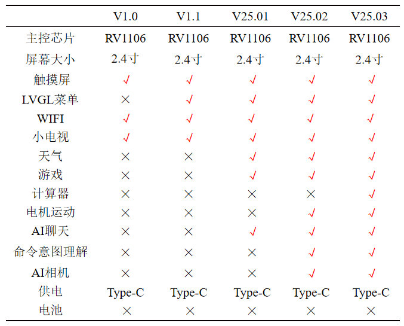

<h1 align="center">Echo-Mate</h1>

<br>

## 1. Overview

本项目是一个十分硬核，功能超多的桌面机器人。是基于RV1106，有LVGL菜单，可以陪你聊天，翻译，看天气，能跑AI相机，小巧的linux桌面助手和开发板~

硬件开源地址：https://oshwhub.com/no_chicken/ai-desktop-robot-echo

演示视频链接: https://www.bilibili.com/video/BV161ZaYyEmF/

手册地址: https://no-chicken.xyz/

<p align="center">
   
</p>


## 2. 功能演示

1. 功能演示截图

   <p align="center">
      
   </p>

2. Desk-Bot demo 功能表

   <p align="center">
      
   </p>

3. 

<br>

## 3. 开发环境

推荐使用`ubuntu22.04 LTS` ，首先拉下整个项目：

```shell
git clone https://github.com/No-Chicken/Echo-Mate.git
cd Echo-Mate
git submodule update --init --recursive
```
如果要递归更新所有子模块，请执行：

```shell
git submodule update --remote --merge --recursive
```
由于子仓库有大文件LFS，，请执行：

```shell
git lfs pull
```

SDK开发环境与系统配置详见SDK文件夹中的[README.md](./SDK/README.md).

桌面机器人demo, 如何烧录使用详见Demo文件夹的[README.md](https://github.com/No-Chicken/Demo4Echo/blob/main/DeskBot_demo/README.md).

<br>

## 4. 仓库目录说明

```
Echo-Mate/
├── Demo/                  # Echo开发板的demo
│   ├── DeskBot_demo/      # AI桌面机器人
│   └── xxx_demo/          # xxx对应的独立子demo
├── SDK/                   # SDK文件夹
│   ├── rv1106-sdk/        # 基于luckfox的SDK
│   └── README             # SDK和开发板使用相关说明
```
