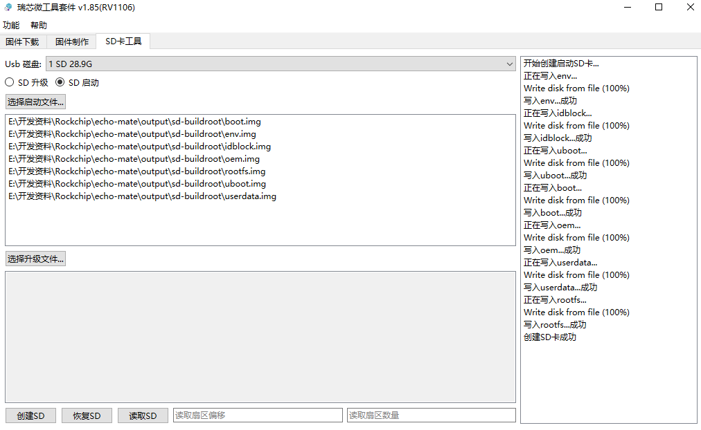
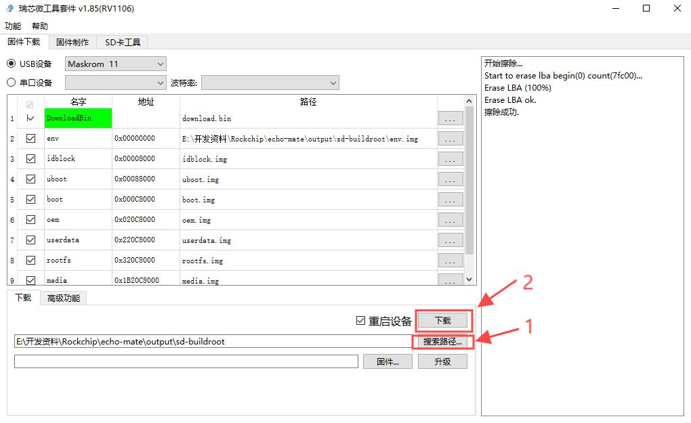

# Echo Mate - SDK

</br>

## :ledger: 1. 获取SDK

你可以使用luckfox的仓库的SDK，但是需要自行改一些东西，例如：`.dts`, `.mk`,  `build.sh`, `insmod_wifi.sh`, `kernal config`, `buildroot config`等

推荐直接使用本仓库改好的SDK，如下：

```shell
git clone https://github.com/No-Chicken/Echo-Mate.git
cd Echo-Mate
git submodule update --init --recursive
cd ./SDK/rv1106-sdk
```

</br>

## 📥2. 安装依赖

```shell
sudo apt-get install repo git ssh make gcc gcc-multilib g++-multilib module-assistant expect g++ gawk texinfo libssl-dev bison flex fakeroot cmake unzip gperf autoconf device-tree-compiler libncurses5-dev pkg-config
```

</br>

<details>
<summary><h2>✒️3. 更改SDK示例</h2></summary>


### 注：不需要改可跳过以下操作：

1. SDK目录如下
   ```
   ├── build.sh -> project/build.sh ---- SDK编译脚本
   ├── media --------------------------- 多媒体编解码、ISP等算法相关（可独立SDK编译）
   ├── sysdrv -------------------------- U-Boot、kernel、rootfs目录（可独立SDK编译）
   ├── project ------------------------- 参考应用、编译配置以及脚本目录
   ├── output -------------------------- SDK编译后镜像文件存放目录
   └── tools --------------------------- 烧录镜像打包工具以及烧录工具
   ```

2. 设备树路径：`<SDK路径>/sysdrv/source/kernel/arch/arm/boot/dts/xxxx.dts`


3. 板载配置路径：`<SDK路径>/project/cfg/BoardConfig_IPC/BoardConfig-SD_CARD-Buildroot-RV1106_Echo_Mate-DeskMate.mk`


4. 配置kernel设置：`<SDK路径>/sysdrv/source/kernel`，修改`kernel config`

   ```shell
   cp ./arch/arm/configs/echo_rv1106_linux_defconfig .config
   make ARCH=arm menuconfig
   ```
   <p align="center">
   	
   </p>

   设置完，然后保存

   ```shell
   make ARCH=arm savedefconfig
   cp defconfig ./arch/arm/configs/echo_rv1106_linux_defconfig
   ```

5. 配置buildroot设置：修改`buildroot config`，加入你需要的包，例如`iftop`，`wpa_supplicant`，

   ```shell
   make echo_mate_defconfig
   make menuconfig
   ```
   设置完，然后保存
   ```shell
   make savedefconfig
   ```

</details>

</br>

## 🔨4. 编译

1. 首先需要在SDK文件夹选择板级配置，这里选择对应的开发板，选择echo mate的配置即可。如果使用`[7]custom`，会弹出所有的`.mk`文件。

   ```shell
   ./build.sh lunch
   ```

2. 一键自动编译

   ```shell
   ./build.sh 
   ```

3. 可自行查阅`<SDK目录>/build.sh`全部可用选项：

   ```shell
   Usage: build.sh [OPTIONS]
   Available options:
   lunch              -Select Board Configure
   env                -build env
   meta               -build meta (optional)
   uboot              -build uboot
   kernel             -build kernel
   rootfs             -build rootfs
   ...
   ```
4. 如果网络不好，可以尝试换buildroot换源, 或直接手动下载包到dl文件夹

</br>

## 📥5. 烧录

### 5.1 SD卡烧录

**注意：** 使用SD卡启动，需要保持SPI NAND FLASH是空白的

1. 首先下载并打开瑞芯微的SocToolKit，进入，选择RV1106

<p align="center">
      	
</p>


2. 把output中的镜像文件如下，烧录到空白的SD卡. SD卡格式化可以使用`SD Card Formatter`。

<p align="center">
      	
</p>


### 5.2 NAND Flash 擦除

1. 打开瑞芯微的SocToolKit，进入，选择RV1106, 选择高级功能，按照步骤进行擦除

<p align="center">
      	
</p>

### 5.3 NAND Flash 烧录

1. 打开瑞芯微的SocToolKit，进入，选择RV1106, 按住boot键然后USB插上电脑, 插上电脑后松开boot, 就会出现Maskrom.

2. 然后选择你的固件路径, 点击下载即可

<p align="center">
      	
</p>

## 📖6. 开发板使用

注：登录账号和密码，改过的SDK都设置为了`root`，如果需要改密码，除了常规的在buildroot deconfig里面更改，还需要在 <rv1106-sdk>/sysdrv/tools/board/buildroot/shadow_defconfig修改你的密码计算哈希值，再编译。


### 6.0 设置时区

1. 打开文件

   ```
   vi /etc/profile
   ```

2. 添加内容

   ```
   export TZ=CST-8
   ```

### 6.1 如何使用WIFI：

1. 开启wifi

   ```
   ifconfig wlan0 up
   ```

2. 进入wpa conf，`vi /etc/wpa_supplicant.conf`，配置wifi名和密码。

   ```bash
   ctrl_interface=/var/run/wpa_supplicant
   ap_scan=1
   update_config=1
   
   network={
           ssid="wifi-name"
           psk="12345678"
           key_mgmt=WPA-PSK
   }
   ```

3. 创建一个socket文件

   ```bash
   mkdir -p /var/run/wpa_supplicant
   ```

4. 然后使用`wpa_supplicant -B -c /etc/wpa_supplicant.conf -i wlan0`连接wifi，然后需要等待一会，会输出以下内容：

   ```bash
   [root@root ]# wpa_supplicant -B -c /etc/wpa_supplicant.conf -i wlan0
   
   Successfully initialized wpa_supplicant
   rfkill: Cannot open RFKILL control device
   [  670.124975] RTL8723BS: rtw_set_802_11_connect(wlan0)  fw_state = 0x00000008
   [  678.988193] RTL8723BS: rtw_set_802_11_connect(wlan0)  fw_state = 0x00000008
   [  688.127631] RTL8723BS: rtw_set_802_11_connect(wlan0)  fw_state = 0x00000008
   [  697.804890] RTL8723BS: rtw_set_802_11_connect(wlan0)  fw_state = 0x00000008
   [  698.446240] RTL8723BS: start auth
   [  698.466241] RTL8723BS: auth success, start assoc
   [  698.521065] RTL8723BS: rtw_cfg80211_indicate_connect(wlan0) BSS not found !!
   [  698.521119] RTL8723BS: assoc success
   [  698.598174] RTL8723BS: send eapol packet
   [  698.643221] RTL8723BS: send eapol packet
   [  698.644951] RTL8723BS: set pairwise key camid:4, addr:9e:a4:d3:f5:da:8d, kid:0, type:AES
   [  698.647953] RTL8723BS: set group key camid:5, addr:9e:a4:d3:f5:da:8d, kid:1, type:AES
   ```

5. 上面的wpa_supplicant服务启动后，建议等待一会，再配置IP

   ```bash
   udhcpc -i wlan0
   ```

6. 然后你就可以ping一下baidu等网站测下网络了

7. 如果想要切换`WiFi`，需要重启 `wpa_supplicant` 服务，需要运行

   ```bash
   killall -9 wpa_supplicant 
   ```

<br>

### 6.2 如何传输文件：

1. 使用SSH
   ```bash
   # 传输文件
   scp ./send_file.txt root@172.32.0.93:/root
   # 传输文件夹
   scp -r ./send_files root@172.32.0.93:/root
   ```

2. 其他
   samba, ADB这些详见网上教程
   
<br>

### 6.3 如何测试屏幕：

1. 调节背光
   ```bash
   echo 49 > /sys/class/backlight/backlight/brightness
   ```

2. 测试花屏和清屏
   ```bash
   cat /dev/urandom > /dev/fb0
   cat /dev/zero > /dev/fb0
   ```
   
