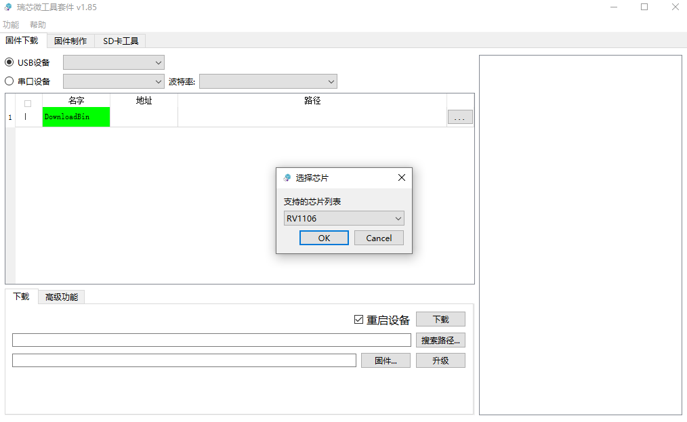
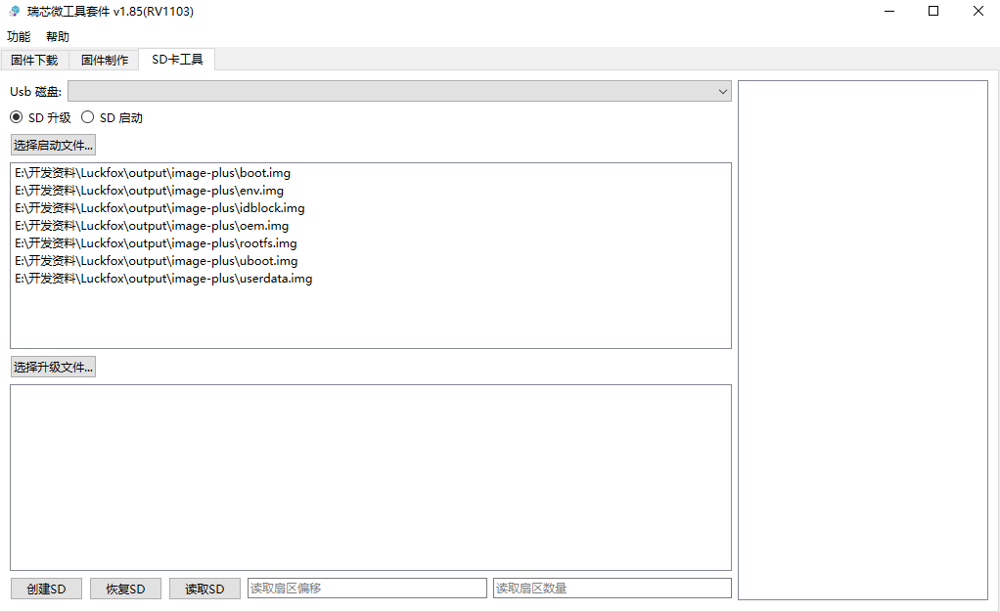

# Echo Mate - SDK

</br>

## :ledger: 1. 获取SDK

你可以使用luckfox的仓库的SDK，但是需要自行改一些东西，例如：`.dts`, `.mk`,  `build.sh`, `insmod_wifi.sh`, `kernal config`, `buildroot config`等

推荐直接使用本仓库改好的SDK，如下：

```shell
git clone https://github.com/No-Chicken/Echo-Mate.git
cd ./SDK/luckfox-pico-sdk
```

</br>

## 📥2. 安装依赖

```shell
sudo apt-get install repo git ssh make gcc gcc-multilib g++-multilib module-assistant expect g++ gawk texinfo libssl-dev bison flex fakeroot cmake unzip gperf autoconf device-tree-compiler libncurses5-dev pkg-config
```

</br>

<details>
<summary><h2>✒️3. 更改SDK示例</h2></summary>


### 注：不需要改可跳过以下操作：

1. SDK目录如下
   ```
   ├── build.sh -> project/build.sh ---- SDK编译脚本
   ├── media --------------------------- 多媒体编解码、ISP等算法相关（可独立SDK编译）
   ├── sysdrv -------------------------- U-Boot、kernel、rootfs目录（可独立SDK编译）
   ├── project ------------------------- 参考应用、编译配置以及脚本目录
   ├── output -------------------------- SDK编译后镜像文件存放目录
   └── tools --------------------------- 烧录镜像打包工具以及烧录工具
   ```

2. 设备树路径：`<SDK路径>/sysdrv/source/kernel/arch/arm/boot/dts/xxxx.dts`


3. 板载配置路径：`<SDK路径>/project/cfg/BoardConfig_IPC/BoardConfig-SD_CARD-Buildroot-RV1106_Echo_Mate-DeskMate.mk`


4. 配置kernel设置：`<SDK路径>/sysdrv/source/kernel`，修改`kernel config`

   ```shell
   cp ./arch/arm/configs/echo_rv1106_linux_defconfig .config
   make ARCH=arm menuconfig
   ```
   <p align="center">
   	
   </p>

   然后保存

   ```shell
   make ARCH=arm savedefconfig
   cp defconfig ./arch/arm/configs/echo_rv1106_linux_defconfig
   ```

5. 配置buildroot设置：修改`buildroot config`，加入你需要的包，例如`iftop`，`wpa_supplicant`，

   ```shell
   make echo_mate_defconfig
   make menuconfig
   ```
   设置完后，再保存
   ```shell
   make savedefconfig
   ```

</details>

</br>

## 🔨4. 编译

1. 首先需要在SDK文件夹选择板级配置，这里选择对应的开发板，选择echo mate的配置即可。如果使用`[7]custom`，会弹出所有的`.mk`文件。

   ```shell
   ./build.sh lunch
   ```

2. 一键自动编译

   ```shell
   ./build.sh 
   ```

3. 可自行查阅`<SDK目录>/build.sh`全部可用选项：

   ```shell
   Usage: build.sh [OPTIONS]
   Available options:
   lunch              -Select Board Configure
   env                -build env
   meta               -build meta (optional)
   uboot              -build uboot
   kernel             -build kernel
   rootfs             -build rootfs
   ...
   ```

</br>

## 📥5. 烧录

### 5.1 SD卡烧录

1. 首先下载并打开瑞芯微的SocToolKit，进入，选择RV1106

<p align="center">
      	
</p>


2. 把output中的镜像文件如下，烧录到空白的SD卡. SD卡格式化可以使用`SD Card Formatter`。

<p align="center">
      	
</p>


### 5.2 NAND Flash烧录

1. 首先下载并打开瑞芯微的SocToolKit，进入，选择RV1106
